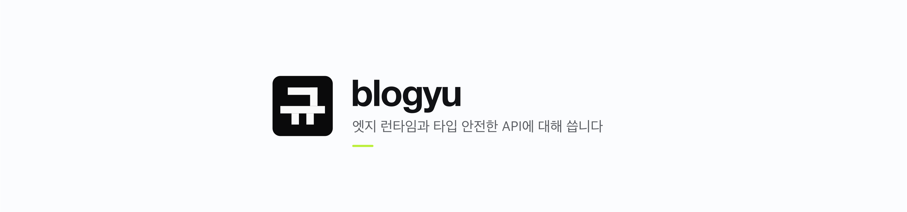
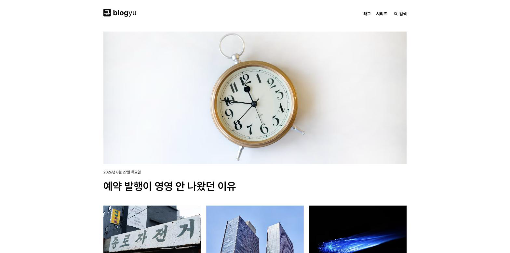
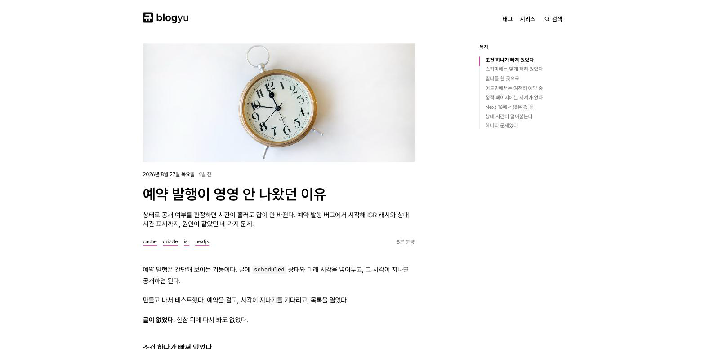
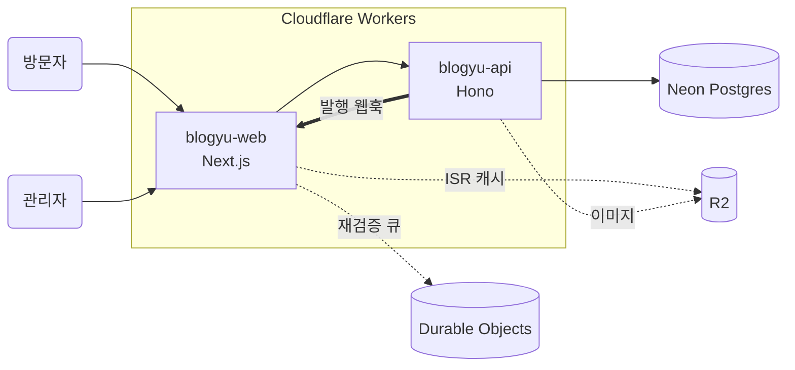

<picture>
  <source media="(prefers-color-scheme: dark)" srcset="docs/assets/banner-dark.png">
  <source media="(prefers-color-scheme: light)" srcset="docs/assets/banner-light.png">
  
</picture>

<div align="center">
  직접 만들어 직접 운영하는 기술 블로그.<br/>
  Next.js 와 Hono 를 Cloudflare Workers 위에 올리고, 전부 무료 티어로 굴린다.
</div>

<div align="center">

[](https://blogyu-web.tech-blogyu.workers.dev)
[](./docs/development.md)
[](./docs/deployment.md)
[](./docs/architecture.md)
[](./LICENSE)

</div>

<div align="center">

[](https://nextjs.org/)
[](https://hono.dev/)
[](https://orm.drizzle.team/)
[](https://neon.tech/)
[](https://workers.cloudflare.com/)
[](https://tailwindcss.com/)
[](https://www.typescriptlang.org/)

</div>

<br/>



<br/>



## 무엇인가

글을 파일이 아니라 DB 에 넣고, 브라우저에서 쓰고 발행하는 블로그다. 정적 사이트 생성기 대신 이 구조를 고른 이유는 하나다 — **글을 고치려고 리포지토리를 열고 싶지 않아서.**

발행하면 API 가 프론트엔드로 웹훅을 쏘고, 해당 페이지만 몇 초 안에 갱신된다. 전체 재빌드는 없다.

화면은 [디자인 시스템 v2](./docs/design/DESIGN.md) — 흰 종이 위 검정 잉크에 마젠타 한 색, 상단 내비와 이미지 카드 그리드, radius·그림자 없음, 라이트 전용 — 를 따른다.

## 기능

- **글쓰기** — 마크다운 에디터, 미리보기, 예약 발행, 이미지 업로드·외부 커버 주소, 시리즈 관리
- **읽기** — 히어로 + 카드 그리드, 목차 레일, 코드 하이라이팅, 태그·시리즈, 한국어 검색
- **캐시** — ISR 로 페이지를 캐시하고, 글을 고치면 그 페이지만 골라 비운다
- **SEO** — 사이트맵·RSS·JSON-LD·canonical, 글마다 OG 이미지를 그려서 내보낸다. 발행하면 IndexNow 로 검색엔진에 알린다
- **AI 크롤러** — `llms.txt` 와 글별 마크다운 원문(`/posts/<slug>/index.md`)을 내보낸다
- **댓글** — Giscus (GitHub Discussions)
- **타입 안전** — 프론트엔드가 백엔드 라우터 타입을 그대로 가져다 쓴다. API 를 고치면 화면 쪽에서 타입 에러가 난다

## 빠른 시작

Docker 와 Node 20.9+ 가 필요하다. Neon 계정은 없어도 된다 — Postgres 와 HTTP 프록시를 컨테이너로 함께 띄운다.

```bash
pnpm install
cp .env.example .env && cp apps/api/.dev.vars.example apps/api/.dev.vars
pnpm db:up && pnpm db:migrate && pnpm db:seed
pnpm dev
```

`http://localhost:3000` 에 글 6편이 들어간 블로그가 뜬다. API 는 `:8787` 이다.

배포와 똑같은 런타임(workerd)에서 확인하려면 `pnpm --filter @blogyu/web run preview` 를 쓴다. R2 캐시와 Durable Object 까지 로컬로 흉내 낸다.

자세한 절차는 [개발 환경](./docs/development.md) 에 있다.

## 구조

```
apps/web    Next.js 16 — 공개 화면, 어드민, ISR
apps/api    Hono — REST API, GitHub OAuth, 이미지 중계
docs/       설계 노트, 디자인 시스템, 배포·개발 문서
```



발행하면 API 가 web 의 `/api/revalidate` 를 때리고, Durable Object 큐가 해당 페이지를 다시 그려 R2 에 넣는다.

## 기술 스택

- [Next.js 16](https://nextjs.org/) — 프론트엔드 (App Router, ISR)
- [Hono](https://hono.dev/) — API 서버, 라우터 타입을 프론트로 내보낸다
- [Drizzle](https://orm.drizzle.team/) — ORM·마이그레이션
- [Neon](https://neon.tech/) — Postgres, HTTP 드라이버로 엣지에서 붙는다
- [Cloudflare Workers](https://workers.cloudflare.com/) — web·api 런타임
- [OpenNext](https://opennext.js.org/cloudflare) — Next.js 를 Workers 에 올리는 어댑터
- [R2](https://developers.cloudflare.com/r2/) + [Durable Objects](https://developers.cloudflare.com/durable-objects/) — ISR 캐시·이미지, 재검증 큐
- [Tailwind v4](https://tailwindcss.com/) — 스타일. 토큰은 `docs/design/theme.css` 가 정본이다
- [Shiki](https://shiki.style/) — 코드 하이라이팅, 테마는 직접 만들었다
- [Biome](https://biomejs.dev/) — 린트·포맷
- [Turborepo](https://turbo.build/) + [pnpm](https://pnpm.io/) — 모노레포

## 배포

`main` 에 푸시하면 GitHub Actions 가 바뀐 앱만 골라 배포한다. 처음 한 번은 Cloudflare 리소스와 시크릿을 직접 만들어야 한다 — [배포 문서](./docs/deployment.md) 에 순서대로 적어뒀다.

무료 티어에서 돌리는 게 목표라 **워커 하나당 3MiB(gzip)** 제한이 실제 제약으로 작동한다. 지금 web 워커는 2.2MiB 다. 이 한도를 어떻게 맞췄는지는 [설계 노트](./docs/architecture.md) 에 있다.

## 라이선스

[MIT](./LICENSE)
